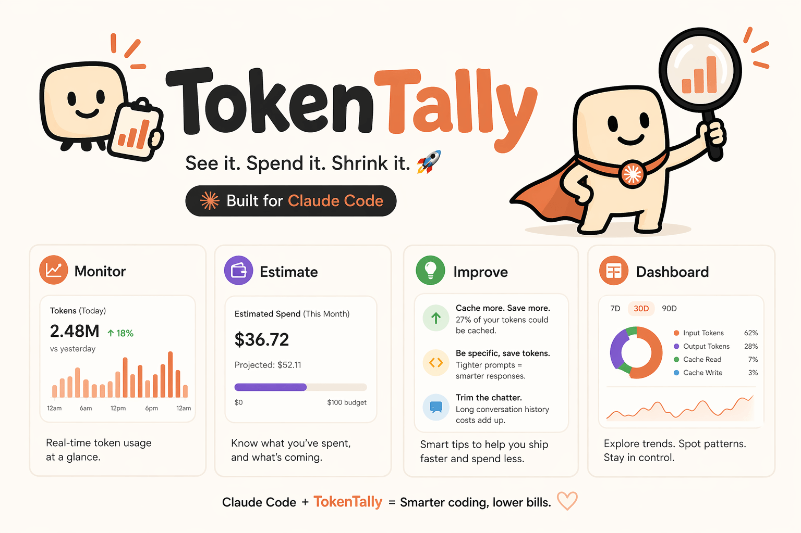

# TokenTally

<p align="center">
  
</p>

A desktop app for tracking Claude Code token usage, costs, and session history. Reads the JSONL transcripts that Claude Code writes to `~/.claude/projects/` and turns them into a live dashboard — no cloud, no account, no telemetry. Runs on Windows and macOS.

---

## Features

### Dashboard tabs

| Tab | What it shows |
| --- | --- |
| **Overview** | Aggregate token usage, cost totals, cache performance, and daily trend chart |
| **Prompts** | Most expensive prompts across all sessions — searchable, sortable, with per-prompt cost breakdown |
| **Sessions** | Session list with turn-by-turn drilldown; hook/attachment rows shown inline |
| **Projects** | Per-project token and cost summaries |
| **Skills** | Breakdown of Claude Code skills invoked across sessions |
| **Tools** | Overage & auth status checker; RTK Token Savings dashboard (see below) |
| **Tips** | Rule-based suggestions: low cache hit rate, high output ratio, many short sessions |
| **Calculator** | Interactive token cost estimator — enter token counts and model to see cost instantly |
| **Settings** | Plan, pricing models, currency, exchange rates, data retention, and Windows service management |

### Cost & pricing

- Per-prompt and aggregate costs using configurable `pricing.json` rates (per 1 M tokens)
- Subscription plan support — Pro / Max show the flat monthly fee as the headline cost with token-equivalent below
- Multi-currency display with live exchange rate refresh
- Fully overridable: edit `pricing.json` in place or point `TOKENTALLY_PRICING_JSON` at your own file

### Cache analytics

- Cache hit rate, 5-minute vs 1-hour cache breakdown, cache creation cost tracking

### RTK Token Savings (Tools tab)

- Runs `rtk gain` and displays a full graphical dashboard: summary stats (commands, input/output/saved tokens, exec time), circular efficiency meter, and a ranked "By Command" table with impact bars
- Detects whether RTK is installed; links to [rtk-ai.app](https://www.rtk-ai.app/) if not

### Data & scanning

- **Incremental JSONL scanner** — tracks `(path, mtime, bytes_read)` per file; only reads new bytes on each tick; safe with mid-flush partial writes
- **30-second background scan loop** — emits a live-refresh event to the UI after each change
- **Data retention** — configurable purge policy; manually trigger via Settings
- **HTML export** — one-click export of the current session to a self-contained HTML report

### Platform integration

| Feature | Windows | macOS |
| --- | --- | --- |
| Desktop GUI (WebView2 / WebKit) | ✓ | ✓ |
| System tray icon (Open, Scan Now, Quit) | ✓ | — |
| Background Windows SCM service | ✓ | — |
| Startup at login (Run registry key) | ✓ | — |

---

## Installation

### macOS

Download `TokenTally.app` and open it, or build from source (see below).

### Windows — quick start (no service)

Download `tokentally.exe` and run it. The dashboard opens immediately and scans every 30 seconds while it's open.

### Windows — with background service (recommended)

Run once as administrator to install the Windows service and add the UI to your login startup:

```
tokentally.exe --install
```

The service (`TokenTally`) starts at boot and keeps `tokentally.db` current. The UI auto-starts at login via the Run registry key. Uninstall with:

```
tokentally.exe --uninstall
```

---

## Data

| Item | Windows default | macOS default |
|------|----------------|---------------|
| Database | `%USERPROFILE%\.claude\tokentally.db` | `~/.claude/tokentally.db` |
| Transcripts scanned | `%USERPROFILE%\.claude\projects\` | `~/.claude/projects/` |

Override with environment variables `TOKENTALLY_DB` and `TOKENTALLY_PROJECTS_DIR`.

---

## Customising pricing

Edit `pricing.json` in the same directory as the binary and reload the dashboard, or point `TOKENTALLY_PRICING_JSON` at any JSON file with the same structure. Rates are per 1 M tokens (USD):

```json
{
  "models": {
    "claude-sonnet-4-6": {
      "tier": "sonnet",
      "input": 3.00, "output": 15.00,
      "cache_read": 0.30, "cache_create_5m": 3.75, "cache_create_1h": 6.00
    }
  },
  "plans": {
    "api":  { "monthly": 0,   "label": "API (pay-per-token)" },
    "pro":  { "monthly": 20,  "label": "Pro" },
    "max":  { "monthly": 100, "label": "Max" }
  }
}
```

---

## Building from source

Prerequisites: [Go 1.22+](https://go.dev/dl/), [Node.js 18+](https://nodejs.org/), [Wails v2 CLI](https://wails.io/docs/gettingstarted/installation).

```bash
git clone <repo-url>
cd tokentally

# Install Vue inspector dependencies (first time, or after npm changes)
npm install --prefix frontend/inspector

# Run tests (any platform)
go test ./...

# macOS
wails build -platform darwin/arm64   # Apple Silicon
wails build -platform darwin/amd64   # Intel
open build/bin/TokenTally.app

# macOS — dev mode (live reload)
wails dev

# Windows
wails build -platform windows/amd64

# Windows — faster build (skips binding generation)
wails build -platform windows/amd64 -skipbindings
```

Output: `build/bin/TokenTally.app` (macOS) or `build/bin/tokentally.exe` (Windows).

> **macOS note:** The system tray and background service are Windows-only. On macOS, closing the window quits the app.

---

## Environment variables

| Variable | Default | Purpose |
|----------|---------|---------|
| `TOKENTALLY_DB` | `~/.claude/tokentally.db` | SQLite database path |
| `TOKENTALLY_PROJECTS_DIR` | `~/.claude/projects` | Directory to scan for JSONL files |
| `TOKENTALLY_PRICING_JSON` | *(embedded)* | Path to a custom `pricing.json` |
