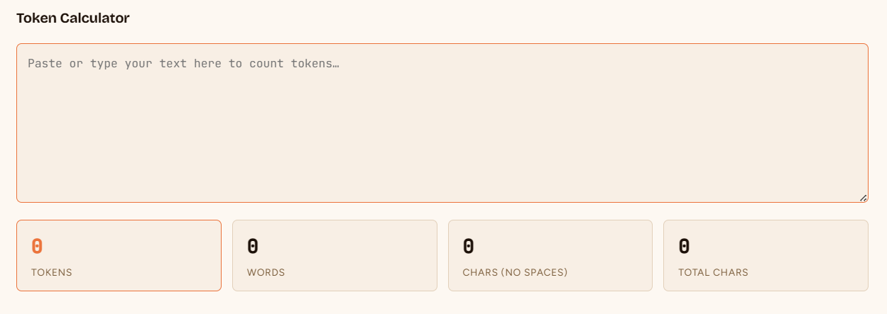

the Token calculator does nto seem to support right clickign and paste via the mouse.
only seems to support Ctrl+v (on windows) for pasting.
Need to add (or fix) that support.

Also would like to add support for dropping a file on the input box, and loadign the text that way.
Should support all standard text based file formats. .txt, .md, all coding file extensions.
Not sure if we need to explicityl whitelist file extensions or can just try any file and if it's text based we accept it. warning if not acecpted.
